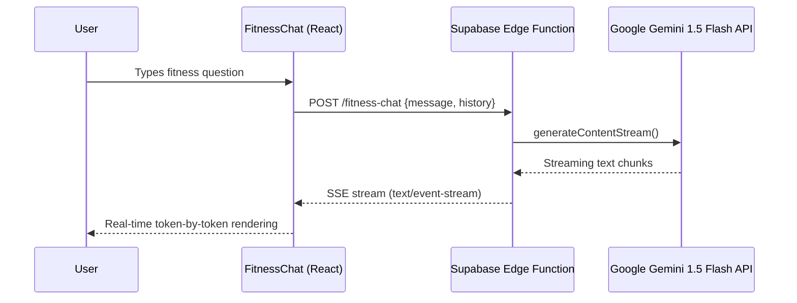
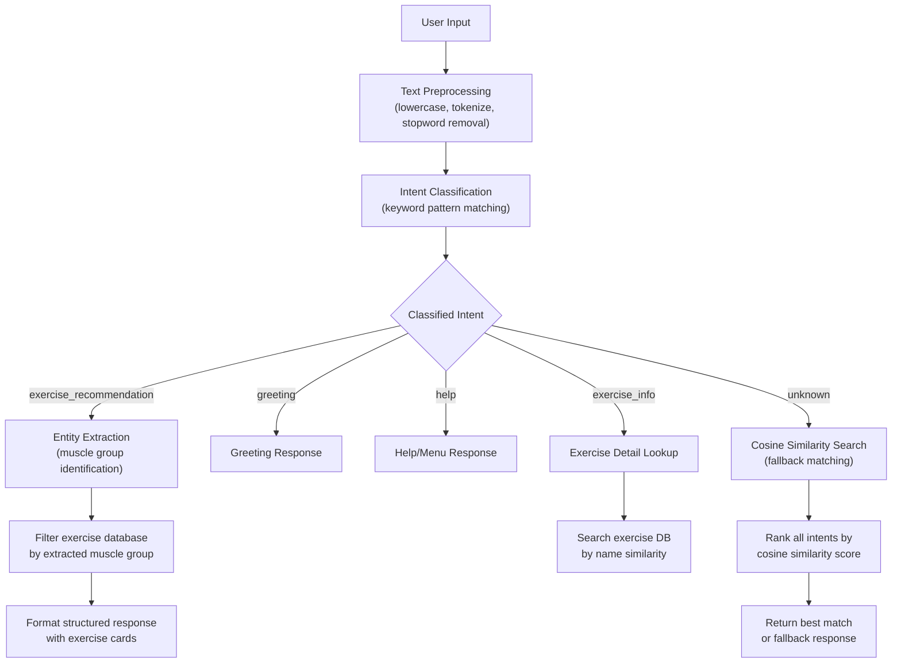

# FitBox — Comprehensive Project Synopsis

## 1. Project Overview

**FitBox** is a full-stack, AI-powered fitness and nutrition web application designed to provide an immersive, personalized health and wellness experience. Built with **React 18**, **TypeScript**, and **Vite**, FitBox combines cutting-edge AI technologies — including **Google Gemini 1.5 Flash** for real-time conversational assistance and a **custom NLP engine** for local intent recognition — with a rich interactive front-end that features an anatomically accurate, SVG-based interactive body diagram, a comprehensive exercise directory, AI-generated custom workout plans, a real-time workout tracker, and a fully personalized Indian nutrition roadmap system. The application uses **Supabase** as its Backend-as-a-Service (BaaS) for authentication, database, and serverless edge functions, enabling secure user management, persistent workout data storage, and cloud-hosted AI inference.

**Technology Stack:**

| Layer | Technology |
|---|---|
| Frontend Framework | React 18 + TypeScript |
| Build Tool | Vite 5 |
| Styling | Tailwind CSS + shadcn/ui component library |
| State Management | React Context API (AuthContext, WorkoutContext) |
| Form Validation | Zod schema validation |
| Routing | React Router DOM v6 (11 routes, protected navigation) |
| Backend-as-a-Service | Supabase (PostgreSQL, Auth, Edge Functions, Row Level Security) |
| AI/ML — Cloud | Google Gemini 1.5 Flash via Supabase Edge Function (streaming SSE) |
| AI/ML — Local | Custom NLP engine with intent classification, entity extraction, similarity scoring |
| Icons | Lucide React |
| HTTP Client | Supabase JS Client |

---

## 2. AI Integration — Deep Dive

> [!IMPORTANT]
> FitBox incorporates **two distinct AI systems** operating at different architectural layers, plus an **AI-driven inspiration scoring algorithm**. These are not superficial integrations — they form the intelligent backbone of the application's personalization engine.

### 2.1 AI System #1: Cloud-Based AI Fitness Chat (Google Gemini 1.5 Flash)

**Component:** [FitnessChat.tsx](file:///c:/Users/deepa/Downloads/musclewebsite%20test%202/art-decoder-tool/src/components/FitnessChat.tsx)
**Backend:** [fitness-chat Edge Function](file:///c:/Users/deepa/Downloads/musclewebsite%20test%202/art-decoder-tool/supabase/functions/fitness-chat/index.ts)

This is the primary AI conversational interface powered by **Google's Gemini 1.5 Flash** large language model, deployed as a **Supabase Edge Function** running on Deno.

#### Architecture



#### Technical Implementation Details

**Edge Function (`fitness-chat/index.ts`):**
- Runs on **Deno runtime** inside Supabase's serverless infrastructure
- Uses the **`@google/generative-ai`** SDK to connect to Google's Gemini API
- Model: **`gemini-1.5-flash`** — optimized for low-latency, high-throughput conversational AI
- Implements **streaming Server-Sent Events (SSE)** — responses are streamed token-by-token to the client, providing a ChatGPT-like typing effect
- Full **conversation history** is maintained and sent with each request, enabling multi-turn contextual dialogue
- Includes a carefully crafted **system prompt** that constrains the model to behave as an expert fitness and nutrition advisor:
  - Provides exercise recommendations based on muscle groups
  - Offers form correction guidance
  - Calculates calorie/macro targets
  - Suggests workout splits and routines
  - Answers nutrition and supplement questions
- **CORS handling** for cross-origin requests from the hosted frontend
- **Error handling** with graceful fallback responses

**Frontend Component (`FitnessChat.tsx`):**
- Floating chat widget accessible from any page via a fixed-position button
- **Real-time streaming display** — uses `ReadableStream` reader to process SSE chunks as they arrive
- Maintains full **conversation history** in React state for multi-turn context
- Message rendering with distinct styling for user vs. AI messages
- **Loading state indicators** during AI response generation
- Auto-scroll behavior to keep latest messages visible
- Expandable/collapsible chat panel with smooth animations

#### AI Capabilities

The Gemini-powered chat can:
1. **Answer fitness questions** — exercise form, muscle targeting, workout programming
2. **Provide personalized recommendations** — based on user-described goals, experience level, and constraints
3. **Explain nutrition concepts** — macronutrients, meal timing, supplementation
4. **Create workout plans** — split routines, full-body programs, progressive overload strategies
5. **Offer injury prevention advice** — warm-up protocols, recovery strategies
6. **Discuss Indian fitness nutrition** — culturally relevant food recommendations

---

### 2.2 AI System #2: Local NLP-Based Gym Trainer Chat

**Component:** [GymTrainerChat.tsx](file:///c:/Users/deepa/Downloads/musclewebsite%20test%202/art-decoder-tool/src/components/GymTrainerChat.tsx)

This is a **client-side AI chatbot** that operates entirely in the browser without any external API calls. It uses a **custom-built Natural Language Processing (NLP) engine** with intent classification, entity extraction, and cosine similarity-based text matching.

#### Architecture



#### NLP Engine — Technical Details

1. **Text Preprocessing Pipeline:**
   - Converts input to lowercase for case-insensitive matching
   - Tokenizes input into individual words
   - Removes common English stopwords (the, is, a, an, etc.)
   - Normalizes whitespace and punctuation

2. **Intent Classification System:**
   - Classifies user input into predefined intents:
     - `greeting` — hello, hi, hey, what's up
     - `exercise_recommendation` — exercises for [body part], workout for [muscle]
     - `exercise_info` — how to do [exercise], what is [exercise]
     - `muscle_info` — information about [muscle group]
     - `workout_plan` — generate a plan, create workout
     - `nutrition` — diet, food, calories, protein
     - `help` — help, menu, options, what can you do
   - Uses **keyword pattern matching** with weighted scoring
   - Falls back to **cosine similarity** when pattern matching confidence is low

3. **Entity Extraction:**
   - Identifies **muscle group entities** from user text (chest, back, legs, arms, shoulders, core, biceps, triceps, etc.)
   - Maps extracted entities to the exercise database's muscle group taxonomy
   - Handles synonyms and variations (e.g., "abs" → "Core", "lats" → "Back")

4. **Cosine Similarity Engine:**
   - Converts text into **term frequency vectors**
   - Computes **cosine similarity** between user input and known intent patterns
   - Used as fallback when direct pattern matching fails
   - Provides confidence scores for intent ranking

5. **Exercise Database Integration:**
   - Directly queries the local `exercises` dataset (612 lines, 50+ exercises)
   - Filters exercises by muscle group, difficulty, and equipment
   - Formats responses with structured exercise cards showing name, difficulty, duration, and equipment

6. **Response Generation:**
   - **Template-based responses** with dynamic content injection
   - Structured formatting with exercise lists, muscle group information, and actionable tips
   - Context-aware suggestions based on the identified intent and entities

#### Key Differentiator

This chatbot operates **entirely offline** — no API keys, no network requests, no latency. It provides instant responses by processing everything in the browser's JavaScript runtime. This makes it:
- **Privacy-preserving** — no user data leaves the device
- **Zero-latency** — responses are instantaneous
- **Always available** — works without internet connectivity
- **Cost-free** — no API usage charges

---

### 2.3 AI System #3: Inspiration-Based Physique Scoring Algorithm

**Module:** [onboarding.ts](file:///c:/Users/deepa/Downloads/musclewebsite%20test%202/art-decoder-tool/src/lib/onboarding.ts) — `deriveInspirationScore()` function

During the onboarding flow, users select a **physique inspiration preset** (Goku, Thor, Captain America, or Toji), each tagged with fitness-related attributes. The system uses a **deterministic tag-analysis algorithm** to classify the user's fitness archetype:

```
Input Tags → Keyword Analysis → Fitness Score Classification
```

**Classification Logic:**
| Inspiration Tags | Derived Score | Meaning |
|---|---|---|
| bulky, powerful, strength | `bulk` | Focus on mass-building programs |
| lean + explosive/agile | `athletic-performance` | Speed, agility, and functional fitness |
| cut, shredded | `cutting` | Fat loss while preserving muscle |
| Mixed/unknown | `strength-hybrid` | Balanced approach |

This AI-derived score influences the downstream personalization of:
- Workout intensity and volume recommendations
- Nutrition calorie surplus/deficit calculations
- Exercise selection priorities

---

### 2.4 AI-Powered Nutrition Personalization Engine

**Module:** [NutritionRoadmap.tsx](file:///c:/Users/deepa/Downloads/musclewebsite%20test%202/art-decoder-tool/src/pages/NutritionRoadmap.tsx) — `calculateNutrition()` function

The nutrition system uses **algorithmic AI** to compute personalized dietary recommendations:

1. **BMR Calculation** — Uses the **Mifflin-St Jeor equation** (the most accurate evidence-based BMR formula):
   - Male: `10 × weight(kg) + 6.25 × height(cm) − 5 × age − 5`
   - Female: `10 × weight(kg) + 6.25 × height(cm) − 5 × age − 161`

2. **TDEE Estimation** — Multiplies BMR by activity level multiplier:
   - Sedentary: ×1.2
   - Moderate (3–5 days/week): ×1.55
   - Active (6–7 days/week): ×1.725

3. **Goal-Based Adjustment:**
   - Bulk: +500 kcal surplus
   - Lean Bulk: +250 kcal surplus
   - Recomposition: maintenance calories

4. **Macro Distribution Computation:**
   - Protein: 2.2g per kg bodyweight
   - Fats: 25% of total calories
   - Carbs: remaining calories after protein and fat allocation

5. **Diet-Aware Food Filtering** — Automatically filters the 150-item Indian food database based on:
   - Dietary preference (vegetarian/non-vegetarian/vegan)
   - Meal role (pre-workout, post-workout, breakfast, main-meal, snack, rest-day)
   - Goal-appropriate meal plans (bulking vs. cutting day plans)

---

## 3. Interactive Muscle Map System

**Component:** [InteractiveBodyDiagram.tsx](file:///c:/Users/deepa/Downloads/musclewebsite%20test%202/art-decoder-tool/src/components/muscle-map/InteractiveBodyDiagram.tsx)
**Mapping Library:** [muscleMapping.ts](file:///c:/Users/deepa/Downloads/musclewebsite%20test%202/art-decoder-tool/src/lib/muscleMapping.ts)

A fully custom-built, **SVG-based interactive human anatomy diagram** — inspired by MuscleWiki — with the following capabilities:

- **19 individually clickable muscle groups** across front and back views:
  - Front: Neck, Shoulders, Chest, Biceps, Forearms, Abs, Obliques, Quads, Adductors, Calves (Tibialis)
  - Back: Traps, Rear Delts, Lats, Rhomboids, Lower Back, Triceps, Glutes, Hamstrings, Calves (Gastrocnemius)
- **Gender toggle** — Male/Female body silhouettes with anatomically adjusted proportions
- **Front/Back view switching** — Desktop shows both simultaneously; mobile shows toggle
- **Hover tooltips** — CSS-positioned tooltip follows the cursor showing muscle name
- **Click-to-select** — Selecting a muscle shows:
  - Muscle name and description
  - Animated exercise count (with easing animation using `requestAnimationFrame`)
  - "Explore Exercises" button that navigates to filtered exercise directory
- **Centralized muscle mapping system** — A dedicated `muscleMapping.ts` library maps 19 diagram IDs to exercise group categories, display names, and route paths
- **Responsive design** — Adapts layout between desktop (side-by-side) and mobile (tabbed) views

---

## 4. Exercise Directory & Detail System

### Exercise Database

**Data file:** [exercises.ts](file:///c:/Users/deepa/Downloads/musclewebsite%20test%202/art-decoder-tool/src/data/exercises.ts) — 612 lines, 50+ exercises

Each exercise record includes:
- `id`, `name`, `muscleGroup` (Chest, Back, Legs, Arms, Shoulders, Core)
- `difficulty` (Beginner, Intermediate, Advanced)
- `duration`, `equipment`
- `video` (YouTube embed URL)
- `description` (detailed form instructions)

### Exercise Directory Page

**Page:** [Exercises.tsx](file:///c:/Users/deepa/Downloads/musclewebsite%20test%202/art-decoder-tool/src/pages/Exercises.tsx)

- **Muscle group filter** — Horizontal filter bar with "All" and individual muscle group buttons
- **Search bar** — Searches by exercise name, muscle group, or equipment
- **Route-based filtering** — When navigated from the muscle map (`/exercises/:muscleId`), auto-selects the correct muscle group using `getExerciseGroupFromDiagramId()`
- **Responsive grid** — 1/2/3/4 column layout adapting to screen size
- **Staggered animations** — Exercise cards animate in with sequential delays

### Exercise Detail Page

**Page:** [ExerciseDetail.tsx](file:///c:/Users/deepa/Downloads/musclewebsite%20test%202/art-decoder-tool/src/pages/ExerciseDetail.tsx)

- Full-page exercise view with:
  - Embedded YouTube video player
  - Difficulty badge with color coding (green/yellow/red)
  - Equipment requirements
  - Duration estimates
  - Detailed description and form instructions
  - Back navigation

---

## 5. AI-Driven Workout Generator

**Page:** [GenerateWorkout.tsx](file:///c:/Users/deepa/Downloads/musclewebsite%20test%202/art-decoder-tool/src/pages/GenerateWorkout.tsx)

A **multi-step, wizard-style workout generator** that creates personalized exercise plans:

### Flow:
1. **Introduction Screen** — Explains the process with animated icons
2. **Fitness Level Selection** — Beginner 🌱 / Intermediate 💪 / Advanced 🏆
3. **Body Part Selection** — Multi-select from Chest, Back, Legs, Arms, Shoulders, Core with checkbox cards
4. **Generated Results** — Filtered exercise grid based on selections showing:
   - Selected level badge
   - Selected body parts as tags
   - Total exercise count
   - Full exercise cards with links to detail pages

The generator uses **intelligent filtering logic** to match exercises from the database to the user's level and target muscle groups, effectively simulating an AI personal trainer's exercise selection process.

---

## 6. Real-Time Workout Tracker

### Workout Context & State Management

**Context:** [WorkoutContext.tsx](file:///c:/Users/deepa/Downloads/musclewebsite%20test%202/art-decoder-tool/src/contexts/WorkoutContext.tsx)

A dedicated React Context providing global workout state with:
- `WorkoutSet` — id, setNumber, weight, reps, completed status
- `ExerciseLog` — id, exerciseName, exerciseId, orderIndex, sets array
- `ActiveWorkout` — name, startedAt timestamp, exercises array
- **Real-time timer** — Elapsed seconds computed via `setInterval` against workout start time
- **CRUD operations** — startWorkout, endWorkout, addExercise, removeExercise, addSet, removeSet, updateSet
- **Computed metrics** — `getCompletedSetsCount()` for progress tracking

### Active Workout Page

**Page:** [ActiveWorkout.tsx](file:///c:/Users/deepa/Downloads/musclewebsite%20test%202/art-decoder-tool/src/pages/ActiveWorkout.tsx)

- **Start Workout Card** — Prompts user to begin a new session
- **Workout Header** — Shows workout name, elapsed time, and finish button
- **Exercise Log Cards** — Per-exercise cards with:
  - Set tracking (weight × reps)
  - Add/remove set buttons
  - Completion checkboxes per set
  - Remove exercise option
- **Add Exercise Drawer** — Slide-up drawer to browse and add exercises
- **Floating Action Button** — Fixed "Add Exercise" button at bottom of screen
- **Finish Confirmation Dialog** — Summarizes completed sets before saving
- **Persistent Save** — Uses `useWorkoutSave` hook to persist workout data to Supabase

### Workout Components

| Component | Purpose |
|---|---|
| [WorkoutHeader.tsx](file:///c:/Users/deepa/Downloads/musclewebsite%20test%202/art-decoder-tool/src/components/workout/WorkoutHeader.tsx) | Timer display, workout name, finish button |
| [ExerciseLogCard.tsx](file:///c:/Users/deepa/Downloads/musclewebsite%20test%202/art-decoder-tool/src/components/workout/ExerciseLogCard.tsx) | Individual exercise with set tracking |
| [AddExerciseDrawer.tsx](file:///c:/Users/deepa/Downloads/musclewebsite%20test%202/art-decoder-tool/src/components/workout/AddExerciseDrawer.tsx) | Exercise browser/selector drawer |
| [StartWorkoutCard.tsx](file:///c:/Users/deepa/Downloads/musclewebsite%20test%202/art-decoder-tool/src/components/workout/StartWorkoutCard.tsx) | Initial workout start prompt |

---

## 7. Personalized Onboarding System

**Page:** [Onboarding.tsx](file:///c:/Users/deepa/Downloads/musclewebsite%20test%202/art-decoder-tool/src/pages/Onboarding.tsx) (33,489 bytes — the largest component)
**Schema Library:** [onboarding.ts](file:///c:/Users/deepa/Downloads/musclewebsite%20test%202/art-decoder-tool/src/lib/onboarding.ts)

A comprehensive **5-step onboarding wizard** that collects user preferences to drive personalization across the platform:

### Step 1: Physique Inspiration
- Choose from **4 character presets**: Goku, Thor, Captain America, Toji
- Each preset is tagged with fitness attributes (lean, explosive, bulky, powerful, etc.)
- Users can upload custom inspiration images
- Free-text notes field (max 120 chars)
- Tags are processed by the `deriveInspirationScore()` AI algorithm

### Step 2: Diet Preferences
- Diet type selection: Omnivore, Vegetarian, Vegan, Eggetarian, Pescatarian
- Optional calorie target input
- Validated with Zod schema (`dietStepSchema`)

### Step 3: Meals & Allergies
- Meal routine: 3 meals, 4–5 meals, or Intermittent Fasting
- Eating window time range (for IF)
- Allergy input with **8 common allergen quick-picks**: pea, soy, nuts, dairy, gluten, eggs, fish, shellfish
- Raw allergy string parsing with `parseAllergies()` utility

### Step 4: Workout Schedule
- Preferred time: Morning, Afternoon, Evening, Flexible
- Optional specific time range picker

### Step 5: Summary & Confirmation
- Full review of all selections
- Data persistence to Supabase

**Validation Architecture:**
All 5 steps use **Zod schemas** for type-safe runtime validation:
- `inspirationStepSchema` — validates images, preset, notes, tags
- `dietStepSchema` — validates diet type, calorie target with smart number coercion
- `mealsStepSchema` — validates routine, eating window, allergies
- `workoutStepSchema` — validates preferred time and time range
- `onboardingSchema` — composite schema combining all steps

The `UserPreferencePayload` interface defines the complete data model that gets sent to the backend.

---

## 8. Indian Nutrition Database & Roadmap

### Indian Food Database

**Data file:** [indianFoodDatabase.ts](file:///c:/Users/deepa/Downloads/musclewebsite%20test%202/art-decoder-tool/src/data/indianFoodDatabase.ts) — 605 lines, ~150 food items

A comprehensive, culturally-specific nutrition database organized into categories:

| Category | Examples |
|---|---|
| Dairy & Milk Products | Whole Milk, Paneer, Curd, Hung Curd, Lassi, Buttermilk, Ghee, Cheese |
| Eggs & Proteins | Whole Egg, Chicken Breast, Chicken Thigh, Fish |
| Pulses & Legumes | Soya Chunks, Dal (multiple varieties), Chana, Sprouts |
| Grains & Cereals | Rice, Roti, Oats, Poha |
| Nuts & Seeds | Almonds, Peanuts, Flaxseeds |
| Fruits & Vegetables | Banana, Sweet Potato, Spinach |

Each `FoodItem` contains:
- Nutritional data: `protein`, `carbs`, `fat`, `calories` per serving
- `costRange` in Indian Rupees (₹)
- `dietType`: veg, non-veg, or vegan
- `mealRoles`: pre-workout, post-workout, breakfast, main-meal, snack, rest-day
- `hindiName` (optional) for regional accessibility
- `notes` with cooking tips and fitness-specific usage advice

Additional data structures:
- `bulkingDayPlan` — Sample daily meal plan for muscle gain (~2800–3000 kcal)
- `cuttingDayPlan` — Sample daily meal plan for fat loss (~1600–1900 kcal)
- `proteinSwaps` — Equivalent food substitution pairs with protein difference data

### Nutrition Questionnaire

**Page:** [NutritionQuestionnaire.tsx](file:///c:/Users/deepa/Downloads/musclewebsite%20test%202/art-decoder-tool/src/pages/NutritionQuestionnaire.tsx)

Collects user data for nutrition plan generation:
- Gender, Age, Weight (kg), Height (cm)
- Goal: Bulk, Lean Bulk, Body Recomposition
- Dietary Preference: Vegetarian, Non-Vegetarian, Vegan
- Activity Level: Sedentary, Moderate, Active

### Nutrition Roadmap

**Page:** [NutritionRoadmap.tsx](file:///c:/Users/deepa/Downloads/musclewebsite%20test%202/art-decoder-tool/src/pages/NutritionRoadmap.tsx)

The generated, personalized nutrition plan with two modes:

**Workout Diet Mode (5 tabs):**
1. **Pre-Workout** — Foods to eat 60–90 min before training (40% carbs, 30% protein, 30% fats)
2. **Post-Workout** — Recovery nutrition 30–45 min after (50% protein, 40% carbs, 10% fats)
3. **Rest Day** — Adjusted calories (15% reduction) with maintained protein
4. **Supplements** — Whey/Plant Protein, Creatine, Fish Oil, Multivitamin, Vitamin D3, plus desi alternatives (Sattu, Coconut Water, Buttermilk)
5. **Food Swaps** — Protein-equivalent substitution pairs

**Non-Workout Diet Mode:**
- Structured by meal timing: Morning (6–8 AM), Lunch (12–2 PM), Snacks (4–5 PM)
- Hydration guidelines
- Key nutritional principles
- Food swap suggestions

Both modes display:
- Personalized calorie target
- Macro breakdown (protein, carbs, fats)
- Sample day plan table
- Food cards with full nutritional info and cost in ₹
- PDF download option

---

## 9. Authentication & User Management

**Context:** [AuthContext.tsx](file:///c:/Users/deepa/Downloads/musclewebsite%20test%202/art-decoder-tool/src/contexts/AuthContext.tsx)
**Page:** [Auth.tsx](file:///c:/Users/deepa/Downloads/musclewebsite%20test%202/art-decoder-tool/src/pages/Auth.tsx)

### Authentication Methods

1. **Full Sign Up** — Username + Phone Number + Password
   - Username normalized to lowercase, used to generate `username@fitbox.app` email for Supabase Auth
   - Zod validation: username (3–30 chars, alphanumeric + underscore/hyphen), phone (10–15 digits), password (8–100 chars)
   - Creates profile in `profiles` table via Supabase Auth triggers

2. **Sign In** — Username + Password
   - Validates via `signInSchema`
   - Authenticates via `supabase.auth.signInWithPassword()`

3. **Continue as Guest** — Name only
   - Creates local-only user stored in `localStorage`
   - No Supabase auth session — limited functionality

### Session Management
- **Auth State Listener** — `supabase.auth.onAuthStateChange()` for real-time session tracking
- **Profile Fetching** — Queries `profiles` table on session establishment
- **Protected Routes** — All main pages require authentication; unauthenticated users redirect to `/auth`
- **Sign Out** — Clears Supabase session + localStorage

---

## 10. Database Architecture (Supabase/PostgreSQL)

The application uses **10 database migrations** defining the schema:

| Migration | Purpose |
|---|---|
| `20251007065544` | Initial schema setup |
| `20251101134400` | Profile/auth extensions |
| `20251101134431` | Extended user data models |
| `20251102102612` | Workout data tables |
| `20251103054711` | Fixes/adjustments |
| `20251104092224` | Additional columns |
| `20251104092451` | Index optimizations |
| `20251107094626` | Major schema expansion (6.5KB — largest migration) |
| `20251225085149` | Holiday update — new features |
| `20251225093343` | Extended feature set |

Key tables include:
- `profiles` — User profiles linked to Supabase Auth via `auth_user_id`
- `workouts` — Completed workout sessions
- `workout_exercises` — Exercises within a workout
- `workout_sets` — Individual sets (weight, reps, completed)

**Row Level Security (RLS)** is enabled to ensure users can only access their own data.

---

## 11. Routing & Navigation Architecture

**Router:** [App.tsx](file:///c:/Users/deepa/Downloads/musclewebsite%20test%202/art-decoder-tool/src/App.tsx) — React Router v6

| Route | Page | Description |
|---|---|---|
| `/auth` | Auth | Login/Signup/Guest access |
| `/onboarding` | Onboarding | 5-step personalization wizard |
| `/` | Index | Dashboard with muscle map, stats, features |
| `/exercises` | Exercises | Full exercise directory |
| `/exercises/:muscleId` | Exercises | Muscle-filtered exercise view |
| `/exercise/:id` | ExerciseDetail | Individual exercise with video |
| `/generate-workout` | GenerateWorkout | AI workout generator wizard |
| `/active-workout` | ActiveWorkout | Real-time workout tracker |
| `/nutrition` | Nutrition | Diet plan selection hub |
| `/nutrition/questionnaire` | NutritionQuestionnaire | User data collection form |
| `/nutrition/roadmap` | NutritionRoadmap | Personalized nutrition plan |

All routes except `/auth` are protected — requiring authentication or guest login.

---

## 12. UI/UX Design System

- **Dark theme** with gradient accents
- **shadcn/ui component library** — Button, Card, Input, Select, Checkbox, Tabs, Dialog, Badge, ScrollArea, RadioGroup, Toast, AlertDialog, Drawer
- **Tailwind CSS** utility-first styling with custom theme tokens (`primary`, `secondary`, `accent`, `fitness-green`)
- **Glassmorphism effects** — `backdrop-blur-sm`, semi-transparent backgrounds (`bg-card/80`, `bg-card/30`)
- **Micro-animations** — Hover scale effects (`hover:scale-105`), staggered card animations, animated exercise counts, pulse effects on icons
- **Responsive design** — Mobile-first with breakpoints at `md` (768px) and `lg` (1024px)
- **lucide-react icons** throughout — Dumbbell, Target, Zap, Play, Clock, Utensils, Sparkles, ArrowLeft, etc.

---

## 13. Component Architecture Summary

The project contains **71+ components** organized as:

| Directory | Count | Purpose |
|---|---|---|
| `components/ui/` | ~30 | shadcn/ui base components |
| `components/workout/` | 4 | Workout tracking UI |
| `components/muscle-map/` | 3 | Interactive body diagram |
| `components/` (root) | ~12 | Feature components (Header, FitnessChat, GymTrainerChat, ExerciseCard, ExerciseModal, MuscleGroupFilter, BodyDiagram, etc.) |
| `pages/` | 11 | Full page components |
| `contexts/` | 2 | AuthContext, WorkoutContext |
| `hooks/` | 4 | useToast, useWorkoutSave, useMobile, useIsMobile |
| `lib/` | 3 | onboarding, muscleMapping, utils |
| `data/` | 2 | exercises, indianFoodDatabase |
| `integrations/` | 2 | Supabase client + types |

---

## 14. Summary of AI Features for Reference

| # | AI Feature | Type | Technology | Key File |
|---|---|---|---|---|
| 1 | **AI Fitness Chat** | Cloud LLM | Google Gemini 1.5 Flash (streaming SSE) | `FitnessChat.tsx` + `fitness-chat/index.ts` |
| 2 | **Gym Trainer Chatbot** | Local NLP | Custom intent classifier + cosine similarity + entity extraction | `GymTrainerChat.tsx` |
| 3 | **Inspiration Scoring** | Deterministic AI | Tag-based classification algorithm | `onboarding.ts` → `deriveInspirationScore()` |
| 4 | **Nutrition Calculator** | Algorithmic AI | Mifflin-St Jeor equation + macro optimization | `NutritionRoadmap.tsx` → `calculateNutrition()` |
| 5 | **Smart Food Filtering** | Data Intelligence | Diet-aware, meal-role-based food recommendation engine | `NutritionRoadmap.tsx` → `getFilteredFoods()` |
| 6 | **Workout Generator** | Intelligent Filtering | Level + body-part multi-criteria exercise selection | `GenerateWorkout.tsx` → `getFilteredExercises()` |
| 7 | **Muscle-to-Exercise Linking** | Knowledge Graph | Centralized mapping system connecting anatomy to exercises | `muscleMapping.ts` |
