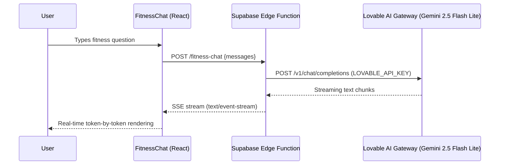
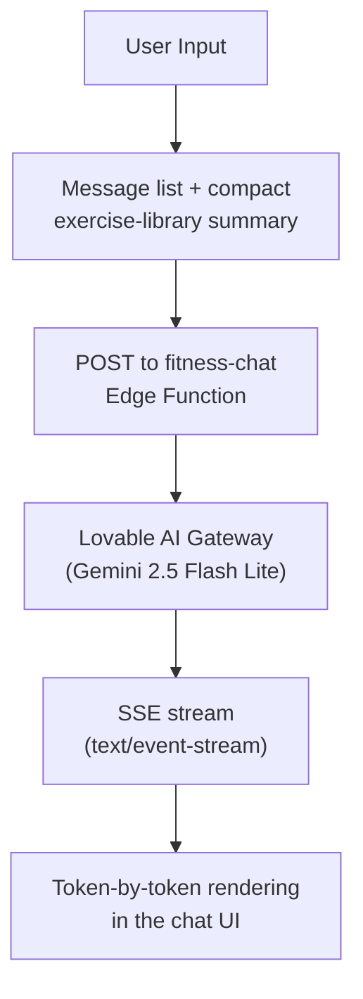

# FitBox — Comprehensive Project Synopsis

## 1. Project Overview

**FitBox** is a full-stack, AI-powered fitness and nutrition web application designed to provide an immersive, personalized health and wellness experience. Built with **React 18**, **TypeScript**, and **Vite 5**, FitBox combines Google Gemini 2.5 Flash Lite assistants, streamed fitness coaching, project-aware help, and a rich interactive front-end featuring an anatomically accurate SVG body diagram, a comprehensive exercise directory, AI-generated workout plans, a real-time workout tracker, a social GymBuddy matching engine, and an Indian nutrition roadmap system. The application uses **Supabase** as its Backend-as-a-Service (BaaS) for authentication, database, and Deno edge functions.

**Technology Stack:**

| Layer | Technology |
|---|---|
| Frontend Framework | React 18 + TypeScript |
| Build Tool | Vite 5 |
| Styling | Tailwind CSS + shadcn/ui component library |
| State Management | React Context API (`AuthContext`, `WorkoutContext`, `GymBuddyNotificationContext`) |
| Form Validation | Zod schema validation (`authSchemas.ts`, `onboarding.ts`) |
| Routing | React Router DOM v6 (17 routes, protected navigation) |
| Backend-as-a-Service | Supabase (PostgreSQL, Auth, Edge Functions, Row Level Security) |
| AI/ML — Fitness | Google Gemini 2.5 Flash Lite via Lovable Gateway (`fitness-chat` Edge Function, SSE) |
| AI/ML — Project | Google Gemini 2.5 Flash Lite via direct `project-assistant` Edge Function |
| Icons | Lucide React |
| Database Migrations | 14 SQL migrations (`supabase/migrations/`) |
| HTTP Client | Supabase JS Client |

---

## 2. AI Integration — Deep Dive

> [!IMPORTANT]
> FitBox incorporates **three distinct AI assistant surfaces** operating at different architectural layers, plus an **AI-driven inspiration scoring algorithm**. These are not superficial integrations — they form the intelligent backbone of the application's personalization engine.

### 2.1 AI System #1: Cloud-Based AI Fitness Chat (Google Gemini 2.5 Flash Lite via Lovable Gateway)

**Component:** [FitnessChat.tsx](file:///c:/Users/deepa/Downloads/musclewebsite%20test%202/art-decoder-tool/src/components/FitnessChat.tsx)
**Backend:** [fitness-chat Edge Function](file:///c:/Users/deepa/Downloads/musclewebsite%20test%202/art-decoder-tool/supabase/functions/fitness-chat/index.ts)

This is the primary fitness conversational interface powered by **Google's Gemini 2.5 Flash Lite** model routed via the **Lovable AI Gateway**, deployed as a **Supabase Edge Function** running on Deno.

#### Architecture



#### Technical Implementation Details

**Edge Function (`fitness-chat/index.ts`):**
- Runs on **Deno runtime** inside Supabase's serverless infrastructure.
- Uses `LOVABLE_API_KEY` to connect to `https://ai.gateway.lovable.dev/v1/chat/completions`.
- Model: `google/gemini-2.5-flash-lite` — optimized for low-latency, high-throughput conversational AI.
- Implements **streaming Server-Sent Events (SSE)** — responses are streamed token-by-token to the client.
- Full **conversation history** is maintained and sent with each request for multi-turn dialogue.
- Constrained by a detailed system prompt covering workout programming, form correction, macro calculations, and Indian nutrition.

**Frontend Component (`FitnessChat.tsx`):**
- Floating chat widget accessible from any page via a fixed-position button.
- Real-time streaming rendering using `ReadableStream` chunk processing.
- Maintains full conversation history in React state with smooth auto-scroll.

---

### 2.2 AI System #2: Streamed Gym Trainer Chat

**Component:** [GymTrainerChat.tsx](file:///c:/Users/deepa/Downloads/musclewebsite%20test%202/art-decoder-tool/src/components/GymTrainerChat.tsx)

A dashboard chat surface that sends conversation history and a compact exercise-library summary to the `fitness-chat` Edge Function. It uses the same streamed Gemini 2.5 Flash Lite backend as `FitnessChat`, rather than a local NLP or offline engine.

#### Architecture



#### Key Characteristics
- **Streaming Responses** — renders server-sent response chunks as they arrive.
- **Exercise Context** — includes a compact exercise-library summary to ground fitness answers.
- **Authenticated Surface** — shown from the protected dashboard alongside the cloud fitness chat.

### 2.3 AI System #3: Project Assistant

**Component:** `ProjectAssistantChat.tsx`

A globally mounted project-aware assistant that can answer questions about FitBox features, architecture, setup, and implementation. It sends bounded conversation history plus generated project knowledge to the `project-assistant` Supabase Edge Function, which calls Google's Gemini 2.5 Flash Lite API directly and returns JSON.

---

### 2.4 AI System #4: Inspiration-Based Physique Scoring Algorithm

**Module:** [onboarding.ts](file:///c:/Users/deepa/Downloads/musclewebsite%20test%202/art-decoder-tool/src/lib/onboarding.ts) — `deriveInspirationScore()` function

Classifies the user's fitness archetype during onboarding based on preset tags (Goku, Thor, Captain America, Toji):

```
Input Tags → Keyword Analysis → Fitness Score Classification
```

| Inspiration Tags | Derived Score | Meaning |
|---|---|---|
| bulky, powerful, strength | `bulk` | Focus on mass-building programs |
| lean + explosive/agile | `athletic-performance` | Speed, agility, and functional fitness |
| cut, shredded | `cutting` | Fat loss while preserving muscle |
| Mixed/unknown | `strength-hybrid` | Balanced approach |

---

### 2.5 AI-Powered Nutrition Personalization Engine

**Module:** [NutritionRoadmap.tsx](file:///c:/Users/deepa/Downloads/musclewebsite%20test%202/art-decoder-tool/src/pages/NutritionRoadmap.tsx) — `calculateNutrition()` function

Uses the **Mifflin-St Jeor equation** to calculate BMR and TDEE, applying surplus/deficit adjustments (+500 kcal for Bulk, +250 kcal for Lean Bulk) and macro distribution (2.2g/kg protein). Automatically filters the 150-item Indian food database.

---

## 3. Interactive Muscle Map System

**Component:** [InteractiveBodyDiagram.tsx](file:///c:/Users/deepa/Downloads/musclewebsite%20test%202/art-decoder-tool/src/components/muscle-map/InteractiveBodyDiagram.tsx)
**Mapping Library:** [muscleMapping.ts](file:///c:/Users/deepa/Downloads/musclewebsite%20test%202/art-decoder-tool/src/lib/muscleMapping.ts)

A custom **SVG-based interactive anatomy diagram** mapping 19 muscle groups across front and back views with gender toggling, hover tooltips, click selection, and animated exercise counts.

---

## 4. Exercise Directory & Detail System

- **Database:** [`exercises.ts`](file:///c:/Users/deepa/Downloads/musclewebsite%20test%202/art-decoder-tool/src/data/exercises.ts) — 50+ exercises with detailed descriptions, equipment tags, difficulty badges, and YouTube embeds.
- **Directory Page:** [`Exercises.tsx`](file:///c:/Users/deepa/Downloads/musclewebsite%20test%202/art-decoder-tool/src/pages/Exercises.tsx) — Muscle group filtering, search bar, and route-based auto-selection.
- **Detail Page:** [`ExerciseDetail.tsx`](file:///c:/Users/deepa/Downloads/musclewebsite%20test%202/art-decoder-tool/src/pages/ExerciseDetail.tsx) — Dedicated exercise view with embedded video and form instructions.

---

## 5. AI-Driven Workout Generator & Real-Time Tracker

- **Generator:** [`GenerateWorkout.tsx`](file:///c:/Users/deepa/Downloads/musclewebsite%20test%202/art-decoder-tool/src/pages/GenerateWorkout.tsx) — Multi-step wizard creating personalized exercise routines. Direct completion button redirects to `/dashboard`.
- **Tracker Context:** [`WorkoutContext.tsx`](file:///c:/Users/deepa/Downloads/musclewebsite%20test%202/art-decoder-tool/src/contexts/WorkoutContext.tsx) — Global workout session state tracking sets, reps, weight, and elapsed time.
- **Active Workout Page:** [`ActiveWorkout.tsx`](file:///c:/Users/deepa/Downloads/musclewebsite%20test%202/art-decoder-tool/src/pages/ActiveWorkout.tsx) — Live tracking interface with set completion checkboxes and direct `/dashboard` finish routing.
- **Persistence Hook:** [`useWorkoutSave.ts`](file:///c:/Users/deepa/Downloads/musclewebsite%20test%202/art-decoder-tool/src/hooks/useWorkoutSave.ts) — Persists workout logs targeting `public.profiles.id` (`profileId`).

---

## 6. Social Matching Engine (GymBuddy)

- **Discovery Radar:** [`GymBuddyRadar.tsx`](file:///c:/Users/deepa/Downloads/musclewebsite%20test%202/art-decoder-tool/src/components/gymbuddy/GymBuddyRadar.tsx) — Conic sonar radar with interactive search radius (2km–30km) and hoisted static phase constants.
- **Card Swiping:** [`GymBuddyCard.tsx`](file:///c:/Users/deepa/Downloads/musclewebsite%20test%202/art-decoder-tool/src/components/gymbuddy/GymBuddyCard.tsx) — Spring physics card stack with `'push_pull_legs'` union type alignment and Recharts compatibility visualization.
- **Matches & Chat:** [`GymBuddyMatches.tsx`](file:///c:/Users/deepa/Downloads/musclewebsite%20test%202/art-decoder-tool/src/pages/GymBuddyMatches.tsx) & [`useGymBuddyChat.ts`](file:///c:/Users/deepa/Downloads/musclewebsite%20test%202/art-decoder-tool/src/hooks/useGymBuddyChat.ts) — Real-time messaging, match listing, and shared workout streak logging (`gymbuddy_session_logs`).

---

## 7. Authentication & Dual-Identity Architecture

**Context:** [`AuthContext.tsx`](file:///c:/Users/deepa/Downloads/musclewebsite%20test%202/art-decoder-tool/src/contexts/AuthContext.tsx)
**Schemas:** [`authSchemas.ts`](file:///c:/Users/deepa/Downloads/musclewebsite%20test%202/art-decoder-tool/src/lib/authSchemas.ts)

### Dual-Identity Architecture
`AuthContext` provides explicit exposure of two distinct IDs to guarantee database target integrity:
1. `authUserId` — `session.user.id` from `auth.users`, used for all `gymbuddy_*` social tables and realtime channels.
2. `profileId` — `public.profiles.id` from `public.profiles`, used for `workout_sessions` and workout data logs.
3. **Runtime Environment Assertions** — Evaluates ID validity in dev mode (`import.meta.env.DEV`) to prevent cross-table reference errors.

---

## 8. Database Architecture & Migrations

The database consists of **14 migrations** defining profiles, workout sessions, GymBuddy social tables, and persisted onboarding preferences:

| Migration | Focus |
|---|---|
| `20251007065544` | Initial core schema setup |
| `20251101134400`–`20251225093343` | Workouts, profiles, trainer PII vault, audit logs, and feature extensions |
| `20260320000100_create_exercise_media_bucket.sql` | `exercise-media` storage bucket + policies |
| `20260427000000_gymbuddy_schema.sql` | GymBuddy profiles, swipes, matches, messages, and session logs |
| `20260427000001_gymbuddy_realtime.sql` | GymBuddy realtime publication |
| `20260902024538_add_profiles_preferences.sql` | `profiles.preferences` jsonb for the onboarding wizard |

---

## 9. Routing Architecture

| Route | Purpose |
|---|---|
| `/` | Public landing page |
| `/auth` | Authentication (Sign in, Sign up, Guest) |
| `/onboarding` | 5-step personalization wizard |
| `/dashboard` | Primary dashboard |
| `/exercises` | Exercise directory |
| `/exercises/:muscleId` | Muscle-filtered exercise view |
| `/exercise/:exerciseId` | Detailed exercise view |
| `/generate-workout` | AI workout generator wizard |
| `/workout/active` | Real-time workout tracker |
| `/nutrition` | Nutrition hub |
| `/nutrition/questionnaire` | Macro calculation form |
| `/nutrition/roadmap` | Personalized nutrition roadmap |
| `/gymbuddy/setup` | GymBuddy social profile setup |
| `/gymbuddy/discover` | Proximity radar candidate swiping |
| `/gymbuddy/matches` | Matched buddies & streak badges |
| `/gymbuddy/chat/:matchId` | Real-time match messaging |
| `/gymbuddy/settings` | GymBuddy profile settings |

---

## 10. Summary of AI & Architectural Features

| # | Feature | Architectural Implementation | Key File |
|---|---|---|---|
| 1 | **Cloud Fitness Chat** | Google Gemini 2.5 Flash Lite via Lovable Gateway (SSE) | `FitnessChat.tsx` + `fitness-chat/index.ts` |
| 2 | **Gym Trainer Chat** | Dashboard Gemini 2.5 Flash Lite chat via SSE | `GymTrainerChat.tsx` + `fitness-chat/index.ts` |
| 3 | **Project Assistant** | Direct Gemini 2.5 Flash Lite with generated project context | `ProjectAssistantChat.tsx` + `project-assistant/index.ts` |
| 4 | **Dual-Identity Context** | Explicit `authUserId` vs `profileId` isolation | `AuthContext.tsx` |
| 5 | **GymBuddy Radar & Cards** | Conic radar scanner + framer-motion card swiping | `GymBuddyRadar.tsx`, `GymBuddyCard.tsx` |
| 6 | **Nutrition Personalization** | Mifflin-St Jeor BMR/TDEE + Indian food engine | `NutritionRoadmap.tsx` |
| 7 | **Modular Variant System** | Isolated sibling `*-variants.ts` files | `badge-variants.ts`, `button-variants.ts`, etc. |

---

*End of Comprehensive Project Synopsis.*
