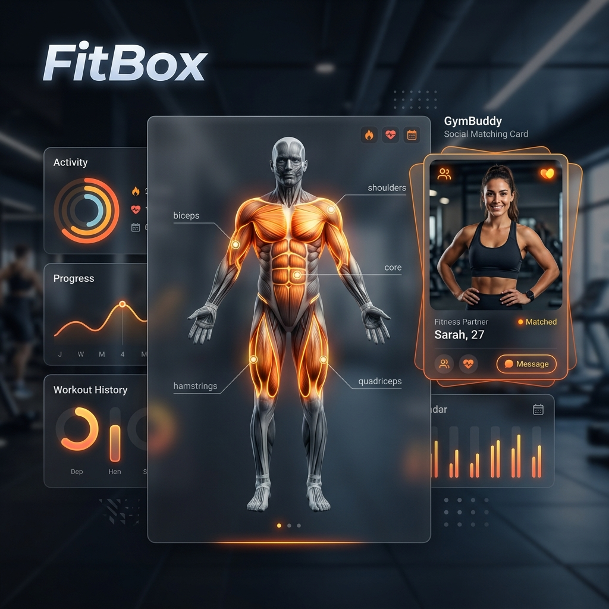

# FitBox — Premium AI-Powered Fitness & Social Hub

**FitBox** is a high-end, full-stack fitness ecosystem that integrates professional coaching, social networking, and advanced data intelligence into a single, cohesive platform. Built for athletes and health enthusiasts, FitBox leverages a dual-AI architecture to provide both deep conversational coaching and instant, zero-latency exercise guidance.



## 🌟 Core Pillars

### 🤝 GymBuddy: The Social Layer
*The ultimate social network for fitness — find your perfect training partner.*
- **Smart Discovery**: Swipe-based matching engine to find local athletes with compatible goals and intensity.
- **Direct Messaging**: Integrated real-time chat with instant notifications to coordinate training sessions.
- **Social Accountability**: Built-in streak tracking and shared session logging to keep both partners motivated.
- **Advanced Profiles**: Showcase your workout splits (PPL, Bro-Split, Upper/Lower) and gym locations.

### 🤖 Intelligence Engine (Dual AI)
- **Cloud Coach (Google Gemini 1.5 Flash)**: A specialized AI assistant running on Supabase Edge Functions. Expert in sports science, biomechanics, and evidence-based nutrition.
- **Local Trainer (Custom NLP)**: A privacy-first, offline-capable NLP engine. Uses intent classification and cosine similarity for instantaneous exercise recommendations.
- **Inspiration Algorithm**: A deterministic AI that analyzes physique presets (Thor, Goku, Toji) to derive personalized training focus.

### 🏋️ The Interactive Lab
- **SVG Anatomy Map**: A precision-engineered, interactive muscle diagram. Click any muscle group to explore targeted exercises with fluid animations.
- **Pro Workout Tracker**: Real-time session interface with set-by-set logging, rest timers, and persistent cloud storage.
- **Smart Generator**: A multi-step wizard that synthesizes custom routines based on difficulty, equipment, and target volume.

### 🥗 Indian Nutrition Roadmap
- **Precision Macros**: BMR and TDEE calculations using the Mifflin-St Jeor equation, tailored for Bulk, Lean Bulk, or Cut cycles.
- **Culturally Specific DB**: 150+ item database of Indian foods, including desi supplement alternatives like Sattu and Buttermilk.
- **Meal Timing Logic**: Smart roadmaps for Pre-Workout, Post-Workout, and Rest-Day nutrition.

---

## 🚀 Technology Stack

| Layer | Technology |
| :--- | :--- |
| **Frontend** | React 18 + TypeScript + Vite 5 |
| **Design** | Tailwind CSS 3 + shadcn/ui + Framer Motion |
| **Backend** | Supabase (PostgreSQL, Auth, Edge Functions, RLS) |
| **AI (Cloud)** | Google Gemini 1.5 Flash (Streaming SSE) |
| **AI (Local)** | Custom NLP Engine (Intent Classification & Similarity) |
| **Intelligence** | TanStack Query v5 + Zod + React Hook Form |
| **Analytics** | Recharts (Progress Visualization) |

---

## 📂 Project Architecture

```bash
fitbox/
├── src/
│   ├── components/
│   │   ├── gymbuddy/       # Social matching & matching UI
│   │   ├── muscle-map/     # SVG interactive anatomy diagram
│   │   ├── workout/        # Live session tracker components
│   │   └── ui/             # shadcn/ui design system primitives
│   ├── contexts/           # Auth, Workout, & Notification providers
│   ├── hooks/              # useGymBuddy, useWorkoutSave, useTrainerContact
│   ├── pages/
│   │   ├── Index.tsx       # Main Dashboard
│   │   ├── GymBuddy*.tsx   # Discover, Matches, & Chat
│   │   ├── Nutrition*.tsx  # Questionnaire & Personalized Roadmaps
│   │   └── ActiveWorkout.tsx # Live tracking interface
│   ├── data/               # Local Exercise & Indian Food Databases
│   └── lib/                # NLP engine, mapping, and core utilities
├── supabase/
│   └── functions/          # Gemini AI & Trainer Contact Edge Functions
└── tailwind.config.ts      # Custom design tokens & theme
```

---

## 💻 Installation

1. **Clone & Setup**
   ```bash
   git clone https://github.com/AaradhyaMalaviya/FitBox.git
   cd fitbox
   npm install
   ```

2. **Environment Configuration**
   Create a `.env` file in the root directory:
   ```env
   VITE_SUPABASE_URL=your_supabase_project_url
   VITE_SUPABASE_ANON_KEY=your_supabase_anon_key
   ```

3. **Development**
   ```bash
   npm run dev
   ```

---

## ✍️ Author

**Aaradhya Malaviya**
- Full-Stack Developer & Fitness Technology Architect
- [GitHub](https://github.com/AaradhyaMalaviya)
- [LinkedIn](https://linkedin.com/in/aaradhyamalaviya)

---

## 📄 License

Proprietary. © 2026 Aaradhya Malaviya. All rights reserved.
